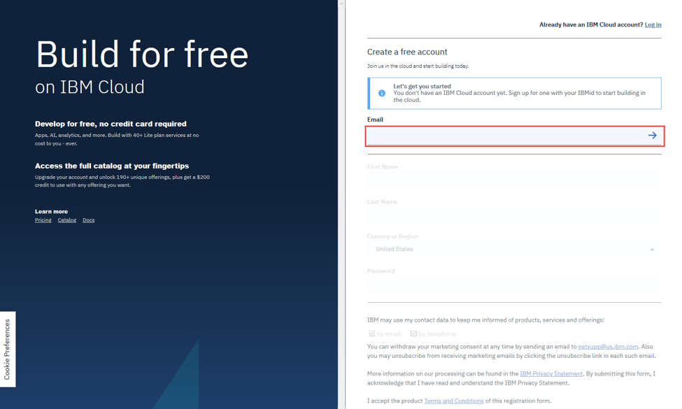
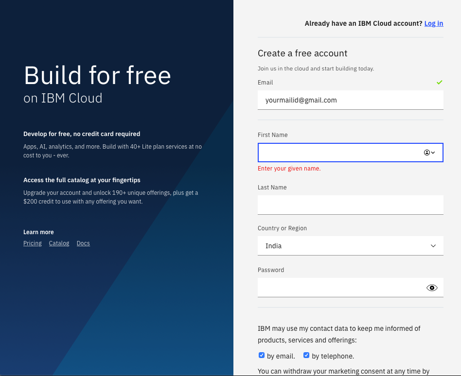
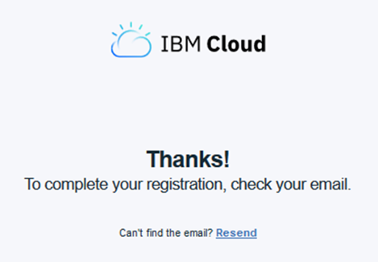
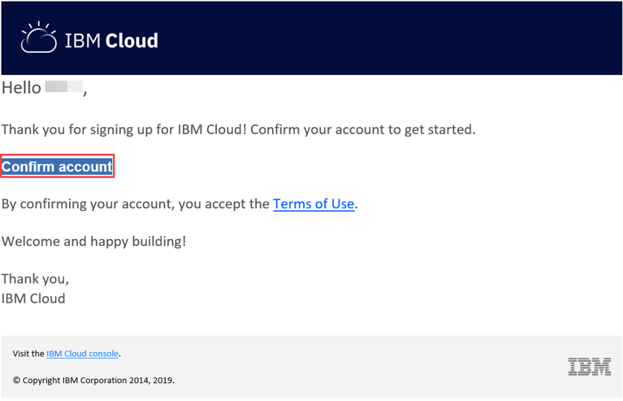
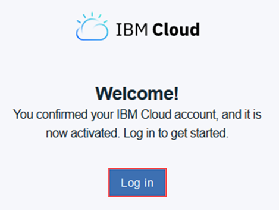
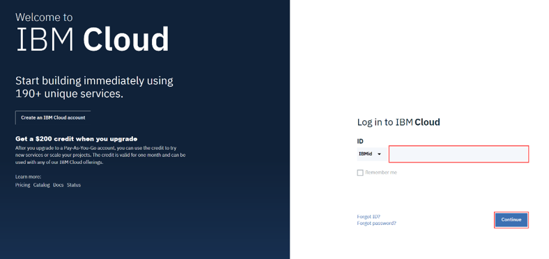
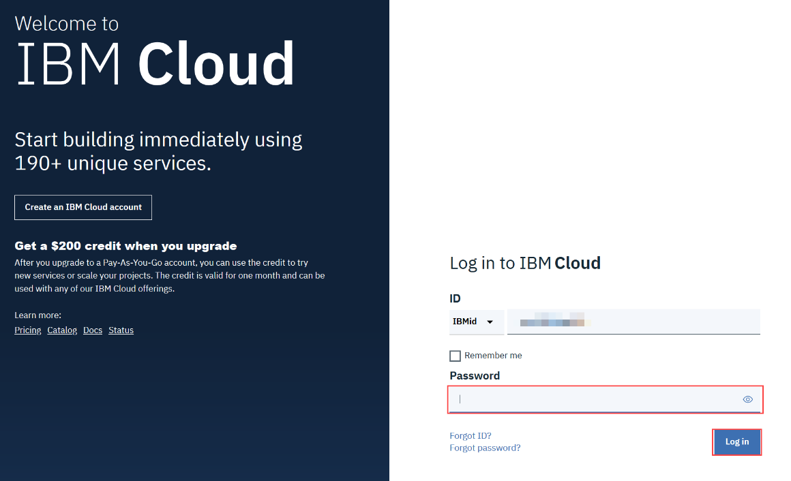

# IBM-intro-and-account-creation
Introduction to IBM Cloud services and how to create a free IBM account 

# Important links 
*https://cloud.ibm.com/registration

*https://www.ibm.com/services/learning/

*https://cognitiveclass.ai/courses

# Step 1: 
## creating a free IBM cloud account 
  1.   Go to: https://cloud.ibm.com/registration to create a free account on IBM Cloud . Please use your personal maild id .
  2.   In the Email box, enter your email address and then click the arrow.

 3.   When your email address is accepted, enter your:First Name, Last Name, Country or Region, and create a Password.

 
 4. If you would like IBM to contact you for any changes to services or new offerings, then check the box to accept the option to be notified by email.

 5.Then click  Create Account to create your IBM Cloud account.

# Hurray You just created a IBM Cloud Account :smiley:	:star: :star: :star:

# Step 2: 
## Activating and conforming the Account 
1.   An email is sent to the address that you signed up with.
 
 

2.   Check your email, and in the email that was sent to you, click Confirm Account.

3.   You will receive notification that your account is confirmed.

:point_right:               Click Log In, and you will be directed to the IBM Cloud Login Page.

# Step3:
## Loging into IBM cloud 

1. If not redirected after clicking login in above step . Click this link https://cloud.ibm.com/login

2. Click continue and enter your password 

Congratulations!  You can now explore the IBM Cloud catalog and provision various services on cloud. There will be no fee unti you choose any paid service insted of lite service which is totaly free.

# IBM Skill Development 

IBM provides manny free couses in skill gatway website and cognitiveclass 

The courses are certifed and have timed exam and the pass percentage of the exam will differ based on the course .

The courses are mainly classifed into basics, medium , advanced.

When you finish the course you will be cetified and receive digital badge of that learing path which can be liked with linkedin , etc .

when you join or finish a course you will get  free credit points which can be linked to your ibm cloud account and used in any of your projects .
